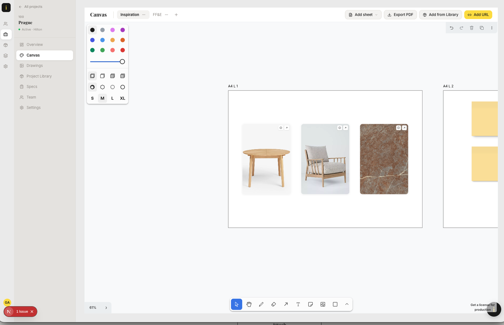
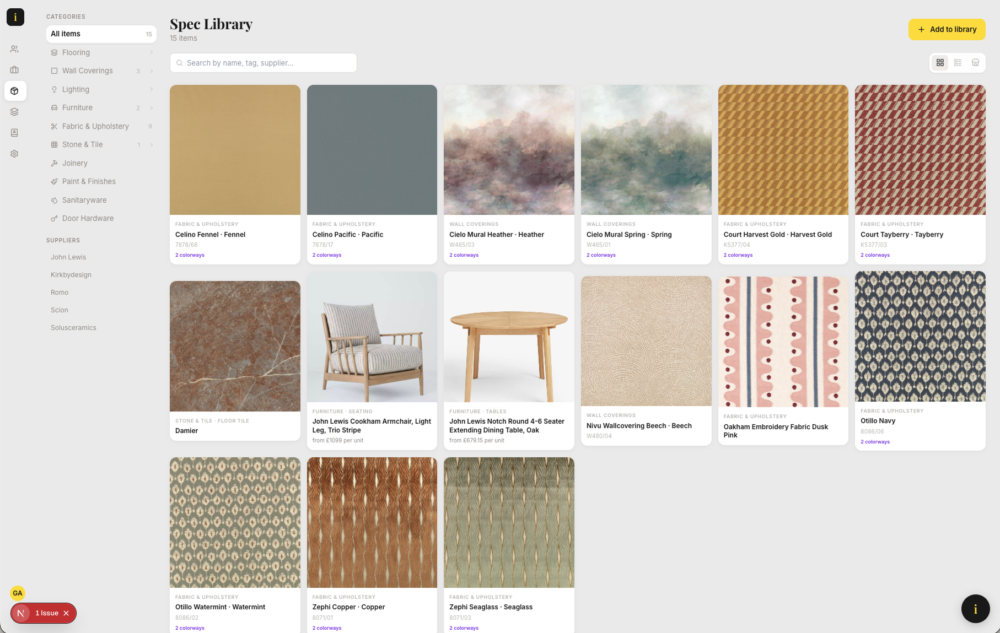
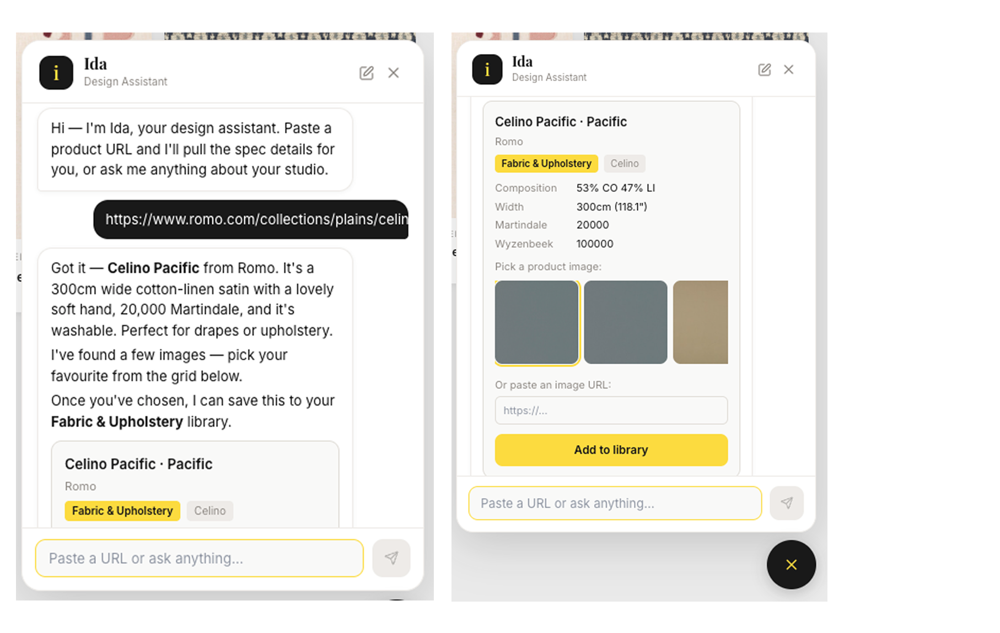

# Ida Designer

A studio-management platform for interior designers — clients, projects, drawings, and FF&E specifications — built around an infinite design canvas and an in-app Claude assistant.

<p align="center">
  
  
  
</p>

## What it is

Interior design studios run on PDFs, spreadsheets, and drawing packages stitched together by hand. Suppliers, contractors, clients, fees, timesheets, and specifications live in disconnected places — which means studios can't meaningfully put AI on top of any of it. Ida Designer builds the interconnected database first, then layers AI where the data supports it.

The product insight came from ten years running [Fabled Studio](https://www.linkedin.com/in/si-gallagher): designers don't want databases — they want canvases. CAD has been an infinite canvas for thirty years, and every other tool in a studio is a spreadsheet. Ida treats the canvas as a first-class surface (built on [tldraw](https://tldraw.dev)) where spec cards are freeform objects on an infinite plane, but each card is a pointer into the underlying relational model. Designers work the way they've always worked; the structured data accrues behind the scenes.

It's a solo project — built by a non-engineer with Claude Code as the implementation partner. Not currently in market; it exists as a working model of how a domain-specific SaaS can be designed and shipped end-to-end.

## Tech stack

| Layer | Technology |
|---|---|
| Framework | Next.js 15 (App Router, RSC, Server Actions) |
| Language | TypeScript, strict mode |
| Database | Supabase — Postgres + Row-Level Security + Storage |
| Auth | Supabase Auth via `@supabase/ssr` (cookie sessions) |
| UI | Tailwind CSS, shadcn/ui (Radix primitives), Lucide icons |
| Canvas | tldraw 4 (custom shapes, PDF export via pdf-lib) |
| AI | Vercel AI SDK with Anthropic (Claude Sonnet + Haiku vision) |
| Scraping | Firecrawl (primary) / Jina Reader (fallback) |
| Hosting | Vercel |

## Architecture

Every architectural decision is written up as an [Architecture Decision Record](docs/adr/) before the code is shipped — 20 ADRs at time of writing. Representative examples: eliminating Supabase RLS recursion on self-referential tables (ADR 007), the spec-template inheritance model that lets project-level specs override global defaults without drift (ADR 009), and the canvas PDF-export pipeline (ADR 019).

| # | Decision |
|---|---|
| [001](docs/adr/001-tech-stack.md) | Tech stack |
| [002](docs/adr/002-multi-tenant-schema.md) | Multi-tenant schema |
| [003](docs/adr/003-shared-clients.md) | Shared clients |
| [004](docs/adr/004-auth-architecture.md) | Auth architecture |
| [005](docs/adr/005-appshell-layout-pattern.md) | AppShell layout pattern |
| [006](docs/adr/006-slide-in-modal-pattern.md) | Slide-in modal pattern |
| [007](docs/adr/007-rls-policy-design.md) | RLS policy design (breaking recursion) |
| [008](docs/adr/008-clients-and-contacts.md) | Clients vs contacts CRM |
| [009](docs/adr/009-spec-library-architecture.md) | Spec library architecture |
| [010](docs/adr/010-contacts-crm.md) | Contacts CRM |
| [011](docs/adr/011-shared-tags.md) | Shared tags |
| [012](docs/adr/012-typescript-type-safety.md) | TypeScript type safety |
| [013](docs/adr/013-studio-roles-project-members.md) | Studio roles + project members |
| [014](docs/adr/014-ida-ai-assistant.md) | Ida AI assistant |
| [015](docs/adr/015-spec-search-vision-tags.md) | Spec search + vision tags |
| [016](docs/adr/016-global-spec-library.md) | Global spec library |
| [017](docs/adr/017-finishes-library.md) | Finishes library |
| [018](docs/adr/018-project-canvas.md) | Project Canvas (tldraw) |
| [019](docs/adr/019-spec-image-rehosting.md) | Spec image re-hosting + PDF export fix |

## The Claude-native parts

Ida, the in-app assistant, handles two core flows: parsing product URLs into structured spec records, and answering natural-language questions over a designer's project data. Both are implemented as tool-calling agents with tightly scoped responsibilities rather than one omnibus assistant. The URL-to-spec flow uses Claude to extract structured fields from arbitrary supplier sites, validates against a shared schema, and writes to the same relational tables a designer would edit manually. The AI and human workflows are fully interoperable; there is no parallel data model.

See [ADR 014](docs/adr/014-ida-ai-assistant.md) for the assistant architecture and [ADR 015](docs/adr/015-spec-search-vision-tags.md) for how visual search works.

## Running locally

```bash
# 1. Install
npm install

# 2. Set up env vars
cp .env.local.example .env.local
# Then fill in values from your Supabase project dashboard
# (see `.env.local.example` for the full list and where to find each)

# 3. Apply migrations to your Supabase project
#    Migrations live in `supabase/migrations/` (001 → 039).
#    Apply via the Supabase SQL editor or CLI.

# 4. (Optional) Seed demo data
#    Edit the developer user ID at the top of supabase/seed.sql first, then:
PGPASSWORD='<your-db-password>' psql \
  "postgresql://postgres@db.<your-project-ref>.supabase.co:5432/postgres" \
  -f supabase/seed.sql

# 5. Run
npm run dev   # → http://localhost:3001
```

Required environment variables (full list with explanations in `.env.local.example`):

| Var | Purpose |
|---|---|
| `NEXT_PUBLIC_SUPABASE_URL` | Public Supabase project URL |
| `NEXT_PUBLIC_SUPABASE_ANON_KEY` | Public anon key (safe to expose) |
| `SUPABASE_SERVICE_ROLE_KEY` | Service role key — **server-only**, bypasses RLS |
| `DATABASE_URL` | Direct Postgres connection for migrations / psql |
| `ANTHROPIC_API_KEY` | Claude API key for the Ida assistant |
| `FIRECRAWL_API_KEY` | Optional — preferred scraper; Jina Reader used as fallback |
| `SETUP_KEY` | Protects the one-time `/api/setup` admin endpoint |

## Useful scripts

```bash
npm run dev                       # start dev server on :3001
npm run build                     # production build
npm run lint                      # next lint
npm run migrate                   # apply SQL migrations
npm run backfill:spec-images      # re-host pre-fix spec images to Supabase Storage
```

## Repo structure

```
src/
  app/          Next.js App Router — pages, layouts, route handlers
  lib/          shared libs — Supabase clients, Ida AI skills, utilities
  types/        hand-written `Database` type (see ADR 012)
  components/   shared React components (shadcn/ui + app-specific)
supabase/
  migrations/   numbered SQL migrations, applied in order
  seed.sql      idempotent demo data (fictional clients)
docs/adr/       20 Architecture Decision Records
memory/         session-to-session project notes
scripts/        one-off Node/TSX scripts (migrations, backfills)
```

## How it's built

Every line of this codebase was written by Claude Code under my direction. I am not a career software engineer — I'm a product operator with technical fluency, and this project is a working model of how someone in that role can architect a Claude-native product end-to-end.

My rhythm per feature: plan → build → break → fix → review for dead code → re-test → write the ADR → start a fresh session. A security sweep (dependency audit, RLS coverage check, secret scan) runs before every push to `main`. The forced documentation — every decision captured in an ADR before moving on — is what makes this workflow viable at the level of complexity the codebase has reached. The commit history and the ADRs are the accurate record of how the thinking happened.

## Known gaps

Honest list of things a second pass would address:

- **No automated tests yet.** The highest-value place to start would be RLS policy coverage and the URL-scrape pipeline — both have real edge-case behaviour worth locking in.
- **No CI.** A minimal `lint + typecheck + build` GitHub Actions workflow is the obvious next step.
- **Hand-written `Database` type** in `src/types/database.ts` — intentional while the schema is still in motion (see ADR 012), but should switch to `supabase gen types` once it stabilises.
- **Backfill for global spec images** isn't automated — only studio-level specs are re-hosted on save (see ADR 019). A batch pass over `global_specs.image_url` is pending.
- **Multi-studio switching UX** is partial — the cookie-based studio context works but there's no in-app switcher for users who belong to more than one studio.

## License

All rights reserved. Source available for portfolio review.
